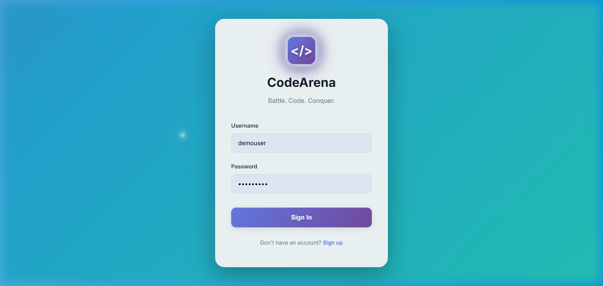
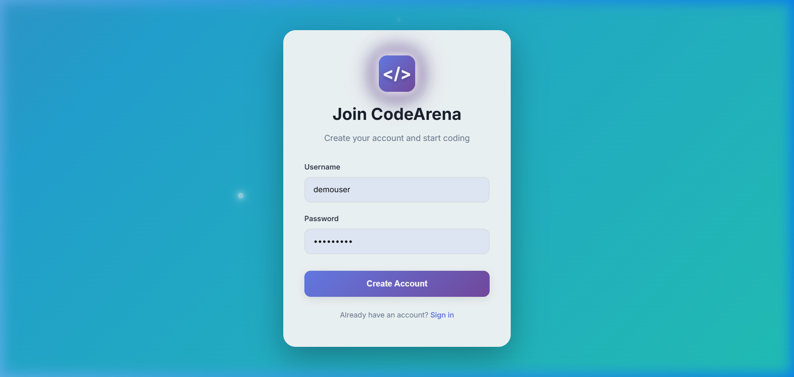
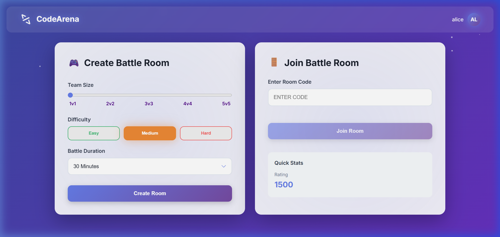
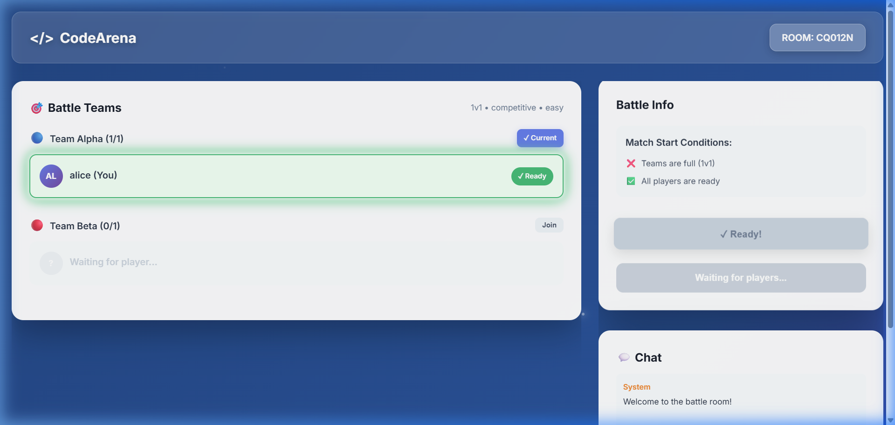
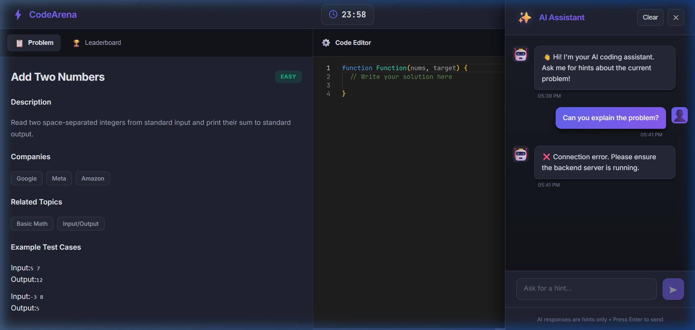
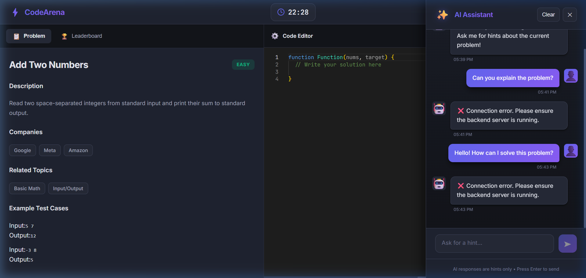
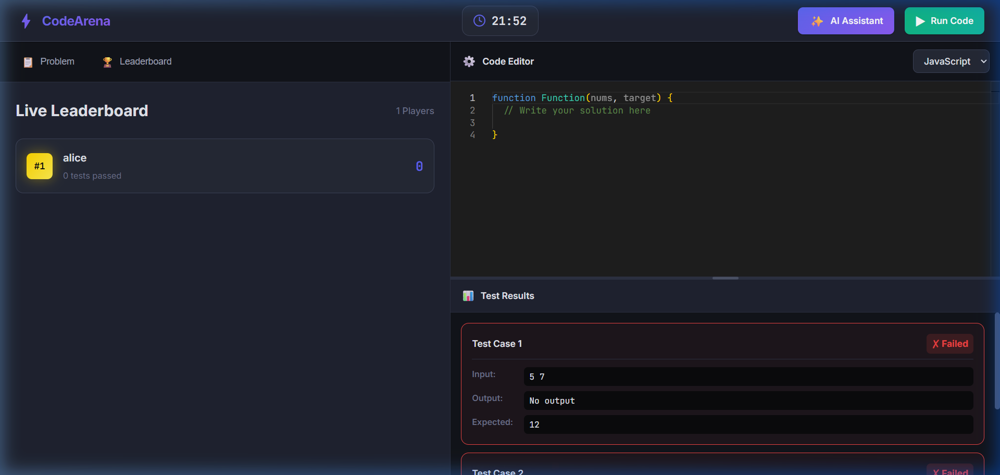
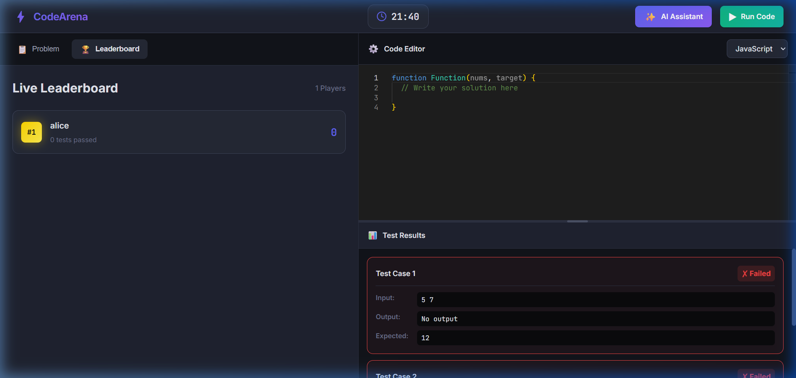
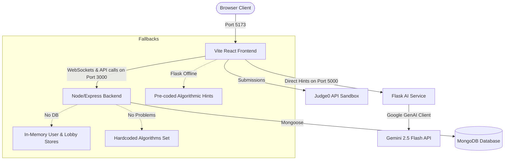

# ⚡ CodeArena

CodeArena is a premium, real-time multiplayer coding battle platform designed to challenge developers in speed and logic. Competitors can join lobbies, form teams, and solve algorithmic challenges while tracking their progress live on a real-time leaderboard, all with the assistance of an integrated Gemini-powered AI coding assistant.

---

## 🚀 Key Features

*   **Real-time Multiplayer Lobby (Socket.io)**: Create or join rooms via unique code, chat with other participants, switch teams (Alpha vs Beta), and synchronize ready state.
*   **Gemini AI Coding Assistant**: An integrated AI sidebar that provides smart, concise, one-liner hints to players without giving away the full code solution.
*   **Sandbox Code Runner (Judge0)**: Real-time code execution with automated test case evaluation across multiple popular languages (JavaScript, Python, C, Java).
*   **Live Leaderboard**: Watch the rankings update dynamically as players pass test cases and earn points.
*   **Offline-Ready Robustness**: Built-in fallback systems for the MongoDB database, algorithmic problems, and AI hints to guarantee functionality even when working locally or offline.
*   **Modern Premium UI/UX**: Designed with a sleek visual system featuring glassmorphism, animated gradient backgrounds, floating particle systems, and responsive layouts.

---

## 📸 Application Walkthrough

### 1. Welcome & Access Control
Manage user sessions with a premium authentication design with floating particles.
<div align="center">
  
  
</div>

### 2. Matchmaking Lobby & Waiting Room
Configure game modes, team sizes (from 1v1 up to 5v5), difficulty levels, and durations, or join a room using a unique code. Inside the waiting room, coordinate teams and readiness live.
<div align="center">
  
  
</div>

### 3. The Coding Arena
Write code in a robust code editor, review problem specifications, compile and test against live testcases, chat with AI, and track scores on the live leaderboard.
<div align="center">
  
  
  
  
</div>

---

## 🛠️ Technology Stack

*   **Frontend**: React, Vite, React Router DOM, Monaco Editor, Lucide React, Tailwind CSS (v4)
*   **Backend**: Node.js, Express, Socket.io, Mongoose (MongoDB)
*   **AI Backend**: Python, Flask, Flask-CORS, Google GenAI SDK (Gemini 2.5 Flash)
*   **Code Sandbox**: Judge0 CE API via RapidAPI

---

## ⚙️ Setup & Installation

### Prerequisites
*   [Node.js](https://nodejs.org/) (v16+ recommended)
*   [Python 3.9+](https://www.python.org/)
*   MongoDB instance (local or Atlas) — *Optional (has fallback store if offline)*

### One-Click Launch (Windows)
Double-click the **`start_all.bat`** file in the root directory. It will automatically run dependency installations (`npm install`, `pip install`) and launch all three servers in separate terminal windows.

### Manual Launch
If you prefer running the servers manually, run the following commands:

1.  **Node.js Backend**:
    ```bash
    cd Backend
    npm install
    npm run dev
    ```
2.  **Vite Frontend**:
    ```bash
    cd Frontend
    npm install
    npm run dev
    ```
3.  **AI Flask Backend**:
    ```bash
    cd ai_flask_backend
    pip install -r requirements.txt
    python app.py
    ```

---

## 💡 Architecture & Fallback Design



If the database or Flask server goes offline, the frontend and backend fall back to local stores automatically, ensuring the platform remains fully functional.
